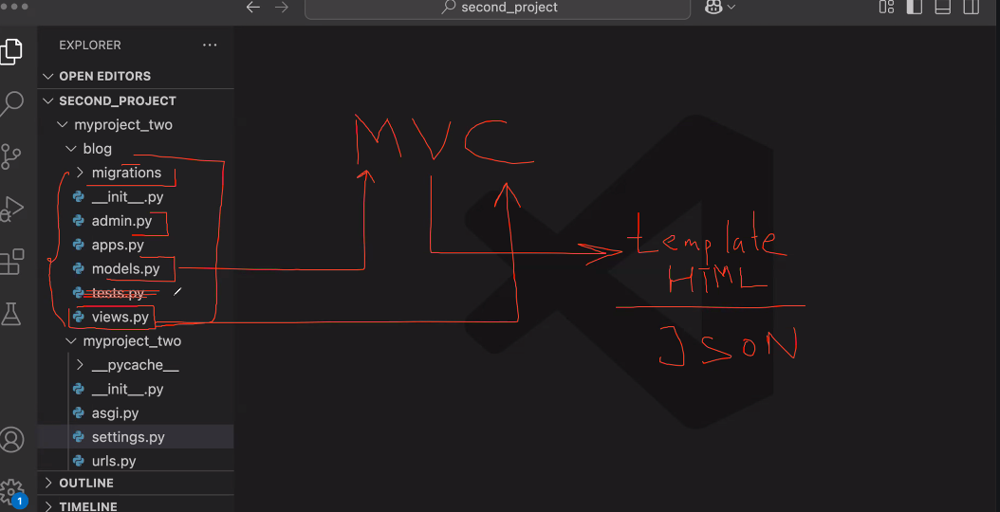
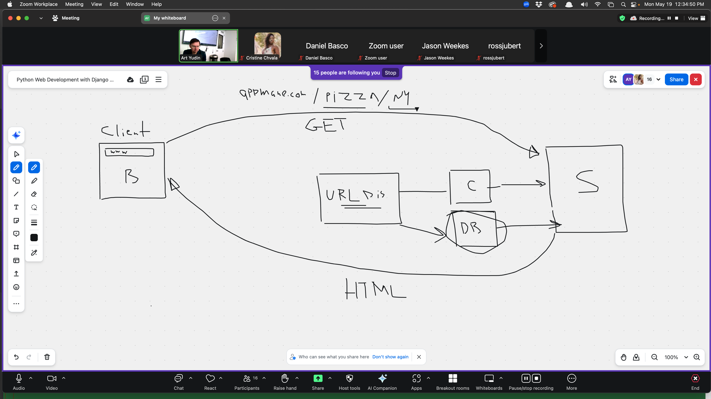
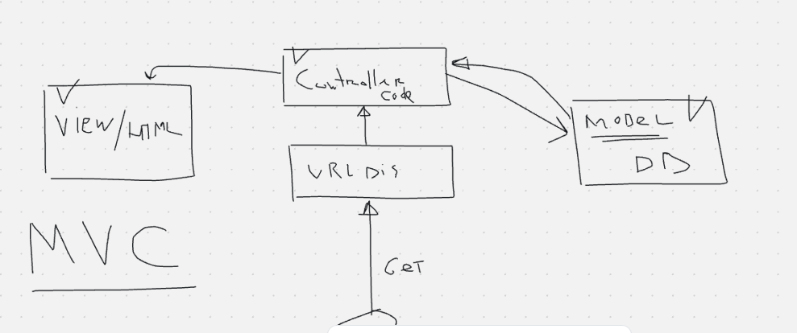
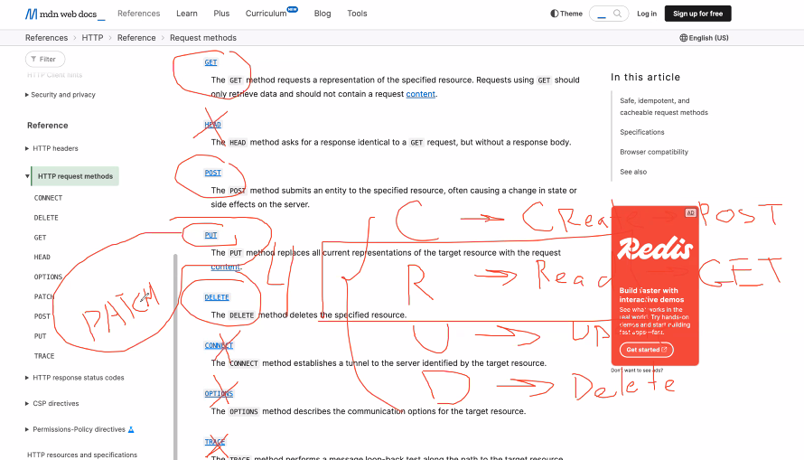

# Work with Terminal on Mac
* **(Cmd + Space)** type Terminal, then press Enter - to open Terminal
* ```pwd``` - Show current directory path 
* ```ls``` - List files in current directory 
* ```ls -l``` - List with details 
* ```cd foldername``` - Change directory 
* ```cd ..``` - Go up one directory 
* ```cd ~``` - Go to home directory 
* ```mkdir new_folder_name``` - Create a new folder 
* ```rm filename``` - Delete a file 
* ```rm -r foldername``` - Delete a folder and its contents
* ```touch filename.txt``` -  Create a new empty file 
* ```cp source.txt dest.txt``` - Copy file 
* ```mv oldname.txt newname.txt``` - Rename or move file 
* ```open .``` - Open current folder in Finder
* ```clear``` -  Clear the terminal screen 
* ```whoami``` -  Show your current username 
* ```top``` - Show running processes (press `q` to quit)
* **(control + 'c')** - kill the server

# Django 
- https://docs.djangoproject.com/en/5.2/howto/deployment/
>is a high-level Python web framework that enables rapid development of secure and maintainable websites. It’s designed to help developers take applications from concept to completion as quickly as possible.

# 3 steps. Do it always in Django
1. Wright code in views.py
2. You need to create url pattern in urls.py
3. Make html template (template/name of app/.html file)

# New project (how to set new project using terminal)
1. create directory
2. open this directory
3. init ```virtualenv venv```
4. activate virtual environment ```source venv/bin/activate```
5. ```pip install django```
6. ```pip install pillow``` - library to work with img
7. ```pip freeze``` - is a terminal command that shows you a list of all Python packages installed in your current environment, along with their exact versions.
8. ```pip freeze > requirements.txt``` -  lists all installed Python packages and their exact versions.
9. ```django-admin``` - create and manage Django projects before the project is fully set up
10. ```django-admin startproject myproject``` - It creates a new Django project
11. ```cd myproject```
12. ```python manage.py migrate ``` - first comment after making new project. Create DB (it will work after you will change directory on "myproject")
13. ```python manage.py startapp garage``` - add new app(module)
14. ```python manage.py createsuperuser``` - Create Super User(admin). Create password. Create username(blank + rootroot for the test project)
15. ```python manage.py runserver```
16. ```http://127.0.0.1:8000/admin``` enter UserName + password - open django administration
17. **after creating project (after 11)**
18. 

## Create module (app)
1. ```python manage.py startapp name```
2. add name in Install_apps in setting.py
3. In directory  blog/views.py wright code. Add directory for template (look in file)
4. /Users/Elen/courses/python_django/first_project/myproject/myproject/urls.py add path and do an import

# DB
- Django goes with  ***db.sqlite3*** 
- **Do it after created model or make some changes in model**
  - ```python manage.py makemigrations``` 
  - ```python manage.py migrate```
  - for model we need some HTML
    - go in admin.py  and add import of model and (admin.site.register(Post or somthing else)) - It will create http request for some page. Check it in admin page
  

## manage.py file -
```python manage.py``` - all available comments 
> is a command-line utility that comes automatically when you create a new Django project

> It acts as a shortcut to manage your Django project

```python manage.py runserver``` - Starts the development server
> past server in browser (Starting development server at http://127.0.0.1:8000/)

# Additional info
- pip - python install manager
 - **model** - DB (DataBace)
 - **MVC** - Model–View–Controller. 
   - **M** 
   > Model(database. Represents the data and business logic of the application.Manages how data is stored, retrieved, and validated.models.py)
   - **V** 
   > views(User Interface. Handles what the user sees.Usually HTML templates or rendered output. )
   - **C** 
   >controller(Function. Handles user input and updates the model or view accordingly.)
 - 
 - **__init.py__** - python modul
 - **asgi.py** and **wsgi.py** - files for server


 - app=modules
 - **CRUD**
   - **C** - Create
   - **R** - Read
   - **U** - Update
   - **D** - Delete
   

# HTTP Request

- **POST**
  - Title(len 250 ch, required, not uniq)
  - Content(len 1000 ch, required)
  - Img
  - **Slag** A slug is a URL-friendly version of a string.  It's typically used in URLs to represent human-readable names or titles.


### Cup game
**Binary search algorithm**
> Binary Search Algorithm is a searching algorithm used in a sorted array by repeatedly dividing the search interval in half. The idea of binary search is to use the information that the array is sorted and reduce the time complexity to O(log N). 


**Bubble Sort**
>  is one of the simplest sorting algorithms.
It repeatedly steps through the list, compares adjacent elements, and swaps them if they are in the wrong order. Over multiple passes, larger elements "bubble up" to the end of the list — that's where the name comes from.

